# 3月份文献阅读(Prompt tuning and Verbalizers)

整理人：陈皓_10205102429

**小结**：近期的工作方向是prompt tuning在知识嵌入方面的微调，阅读文献的重点为prompt tuning整体结构的设计和verbalizer的相关设计方法。（关键于运用知识）

## 1. Knowledgable Prompt Tuning

**论文链接**：[Knowledgeable Prompt-tuning: Incorporating Knowledge into Prompt Verbalizer for Text Classification](https://aclanthology.org/2022.acl-long.158.pdf)

**发表会议**：2022 ACL

**发表单位（院校）**：清华大学

**一作**：Shengding Hu

### 1.1 主体思想

本文主要针对prompt-tuning中的verbalizer部分进行修改，通过引入额外的知识扩展标签词空间，为了更好的利用知识利用PLM重新定义了扩展后的标签词空间。

### 1.2 模型架构

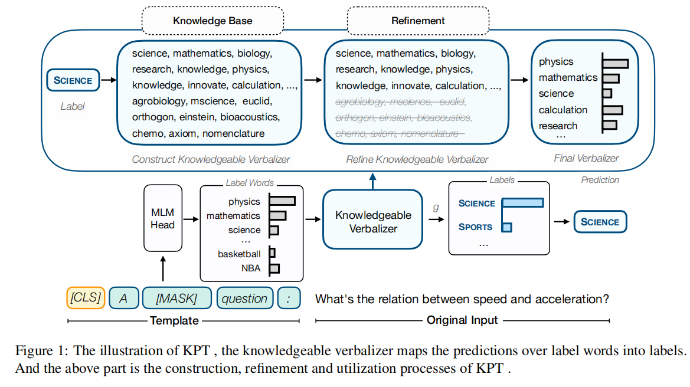

(science和sports均有对应的外部知识，从中判断属于该类别的概率)

**备注说明**：

1. 标签词空间通过已经有的知识图谱被拓展，一个标签对应的词语增多了，拓宽了知识的广度。
2. 预训练语言模型在标签词上预测的概率会被最终转化成标签的概率，哪一个更高，则分类为哪一个标签。
3. 针对于广泛的知识源，词语经过了一定量的精细化（Refine），得出最终所需要运用的知识。
4. 由于人工设计的模板已被证明比自动学习出的模板更加有效，每个数据集使用了4个人工设计的模板，报告4个模板的评价结果和最佳结果
5. KPT始终优于PT，特别是在5-shot和10-shot实验中
6. 对于20-shot，认为标签实例的数量足以优化标签词的嵌入，使其远离原来的词嵌入，从而使知识丰富的语义，所以引入知识的verbalizer提供较少的帮助

**实验结果：**

**zero-shot**

**few-shot**

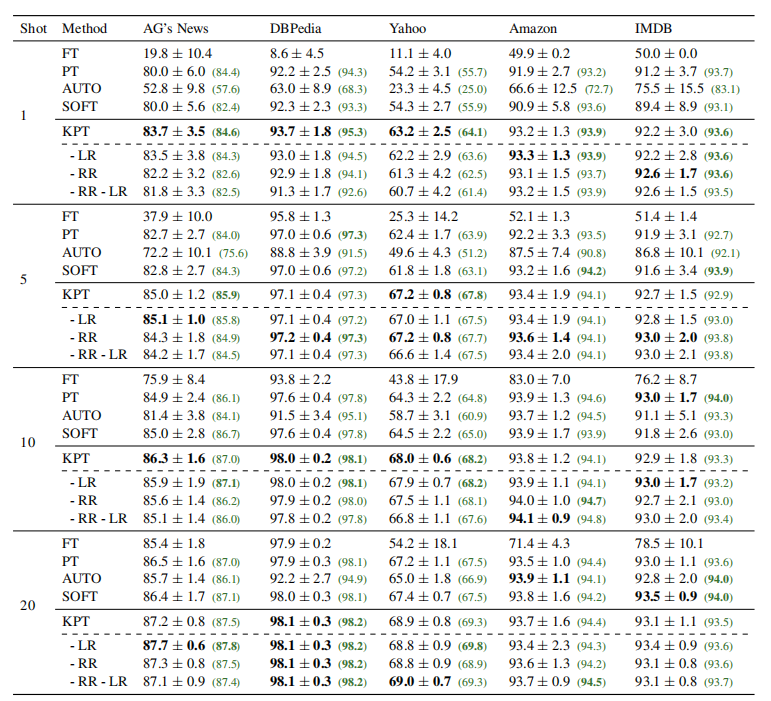

### 1.3 读后感

1. 用更精细化的方法从verbalizer中选择有用的标签词。（预先进行过实验，发现在agnews数据集上较少的知识嵌入也能够取得很好的效果）
2. 在模板构造和verbalizer设计方面用更好方法结合知识库和prompt-tuning
3. 如何构造好一个好的知识嵌入的verbalizer，以及对于verbalizer的功能和架构进行设计，可作为一个研究的方向。

## 2. Pattern-Exploiting Training(PET)

**论文链接**：[Exploiting Cloze Questions for Few Shot Text Classifification and Natural Language Inference](https://aclanthology.org/2021.eacl-main.20.pdf)

**发表会议**：2021 EACL（实际上是2020年写的）

**发表单位（院校）**：慕尼黑大学信息和语言处理中心

**一作**：Timo Schick

### 2.1 主体思想

提出了PET的训练模式以及verbalizer的概念，对于prompt tuning用在分类问题中有着比较显著的意义。

当在小样本学习的领域，有task description存在的情况下，任务的解决会变得更加简单。

### 2.2 模型架构

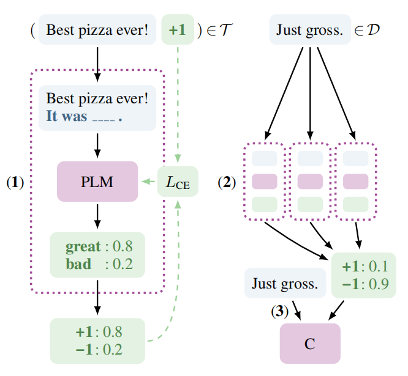

该图表示的是PET工作的三个步骤：

1. 首先，对于每个模式，一个单独的 PLM 在一个小训练集 T 上进行微调。
2. 然后使用所有模型的集合来注释带有软标签的大型未标记数据集 D。（打上的是一个soft label）
3. 最后，在软标记数据集上训练标准分类器。作者还设计了 iPET，这是 PET 的一种迭代变体，其中随着训练集大小的增加重复此过程。

**PVP**：一个(P,v)组成的元组对

P(x)是一个模式，将输入的句子包装。

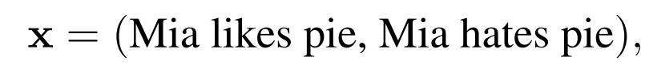

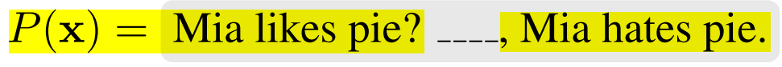

v是一个Verbalizer，将分类问题中的类别映射到要填到空格的词当中（感觉通常上像是单射）。

如正例映射到“Yes”，负例映射到“No”

训练定义：定义一个 M(w∣Z) 表示给定带有一个[MASK]标记的序列 Z，语言模型可以在该[MASK]位置填入词 w∈L 的非归一化得分，即：(M是一个评分函数)

其次定义概率分布(类似于softmax的分布，最终转化成概率的问题）。

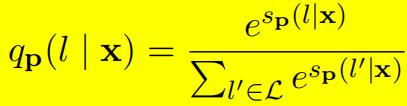

总的损失函数：

**对于给定的PVP，一个难题是如何确定哪一个PVP表现的好，因此需要走以下三步**：（类似于知识蒸馏的方法）

1. 每一个PVP都在一个小的数据集上进行微调。
2. 将每一个预训练模型进行集成、对于每个预训练模型，分别对未标注的数据集 D 进行标注，此时获得的是soft-label，即给定一个输入 X，标签 l∈V 的概率得分：（这个w是权重，Z是权重和，得分走一层softmax被转化成概率分布，用T=2去保持一个soft distribution。打好软标签的数据集为Tc）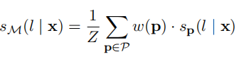
3. 在 Tc 使用标准的微调方法进行微调。微调之后的模型即作为最终的分类器

(有点像知识蒸馏)

**迭代方式的PEI（iPET）**：

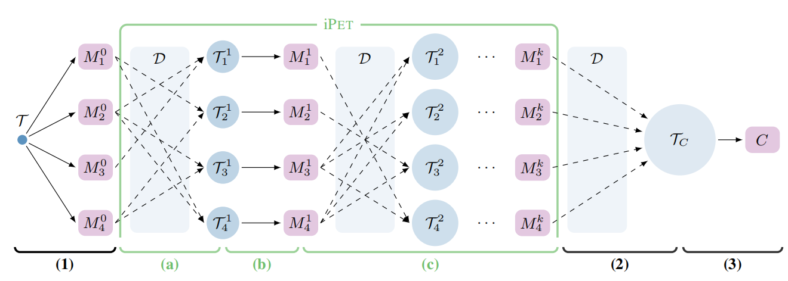

**实验结果**：

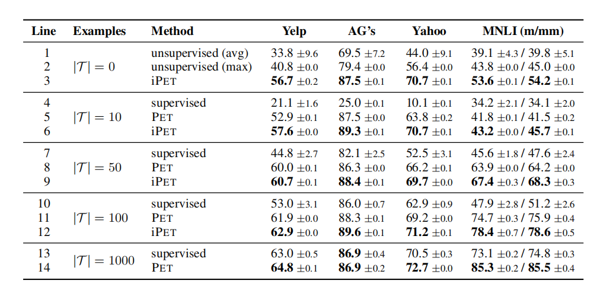

### 2.3 读后感

这篇文献是2021年提出的，但感觉其中的一些方法在相关的数据规模上已经超过了2022年提出来的KPT

## 3. Automatic Verbalizer in Text Classification

**论文链接**：[Automatically Identifying Words That Can Serve as Labels for Few-Shot Text Classification](https://aclanthology.org/2020.coling-main.488.pdf)

**发表会议**：2020 COLING

**发表单位（院校）**：慕尼黑大学信息和语言处理中心

**一作**：Timo Schick

### 3.1 主体思想

依据文章题目，本文的主要贡献是提供了一种自动搜索的方式来决定哪些词可以作为分类问题中的label。

本文可以看成作者对自己第2篇文章的一个拓展。

在上文中，手动定义单词和标签之间的映射需要领域的专业知识和对语言模型能力的理解。本文探寻自动寻找的方式和技术。

本文提出的方法为PETAL（PET *with Automatic Labels* ）。表现可以达到和手工定义的映射一样好的效果。

### 3.2 模型架构

PET模型示例：

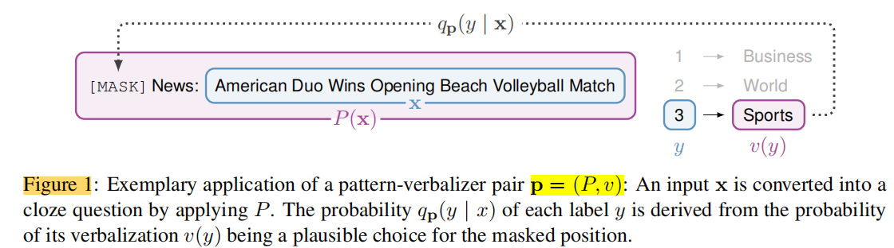

文章花了不小的一部分篇幅来重新叙述PET的架构和训练方式。

极大似然估计来寻找最好的verbalizer：

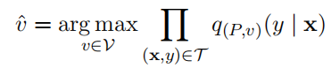

将k分类问题转移成k个二分类的问题，因此每个分类任务的训练集调整为：

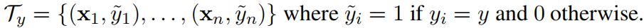

定义概率分布：

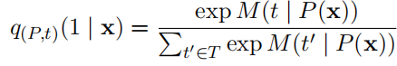

此时满足$q_{(P,t)}(0|x)=1-q_{(P,t)}(1|x)$

考虑到k分类问题被分为k个二分类问题，每个二分类问题中的标签都有不均衡的情况。为保证均衡，需赋权重：(相似的方法在2001年已经提出来了)

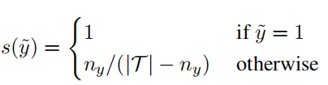

采用LR(likelihood Ratio)作为损失函数：

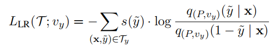

关于作为标签的候选词，作者创建了只包含词汇表的一小部分子集的候选集Vy⊂T：长度大于1的词不要，随后再找10000个最常见的token作为候选集合，同时需要更加偏好于frequent words

生成标签词示例：

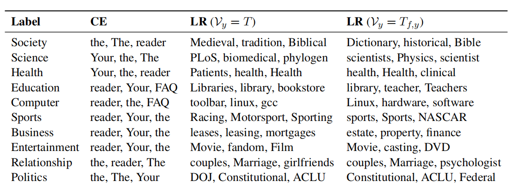

**实验结果**：

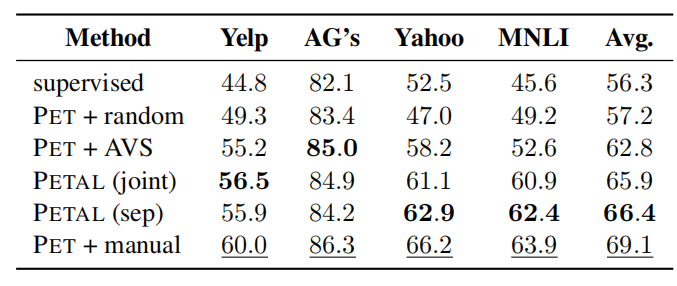

### 3.3 读后感

本文介绍了一种自动搜索label单词的方式，可以有效避免人工设计verbalizer的麻烦。可能可以用于决定哪些外部知识的词语更加合适的情况。

这里词语的来源是实验预设的词表，并不是来自于知识图谱中的外部知识。

## 4.Prompt Tuning with Rules(PTR)

**论文链接**：[PTR: Prompt Tuning with Rules for Text Classification](https://reader.elsevier.com/reader/sd/pii/S2666651022000183?token=F9CF2B34BBD6B9FA503D59FF7C18D82A662B22C2287E8E7167A24F45A9B101E518B64A8BB5D606EA64596BB03BFAF672&originRegion=us-east-1&originCreation=20230321061558)

**发表会议**：AI Open(2022)

**发表单位（院校）**：清华大学

**一作**：Xu Han 

### 4.1 主体思想

缩小预训练和下游任务fine-tune的差距。

### 4.2 模型架构

pre-train，fine-tune和prompt tuning的差别

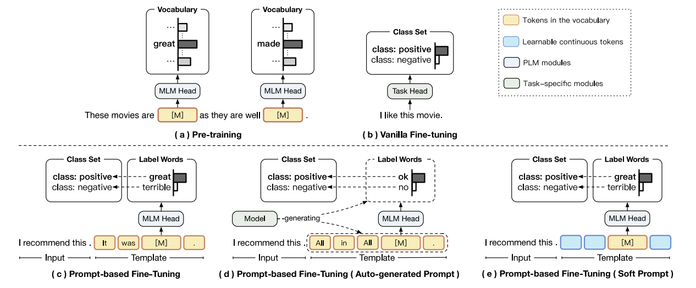

PTR的架构：（感觉用在关系的判断上会比较好）

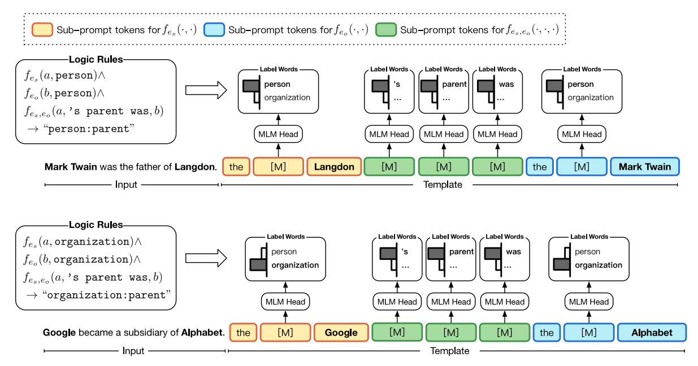

### 4.3 读后感

PTR用在关系抽取和关系分类的问题上会有比较好的效果，但感觉对于sub-task的划分和界定，作者没有叙述的太清楚。此处作为一个参考。
